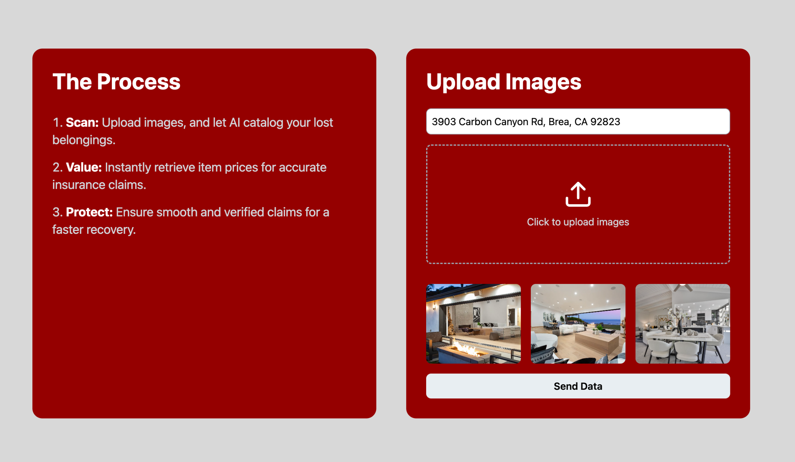
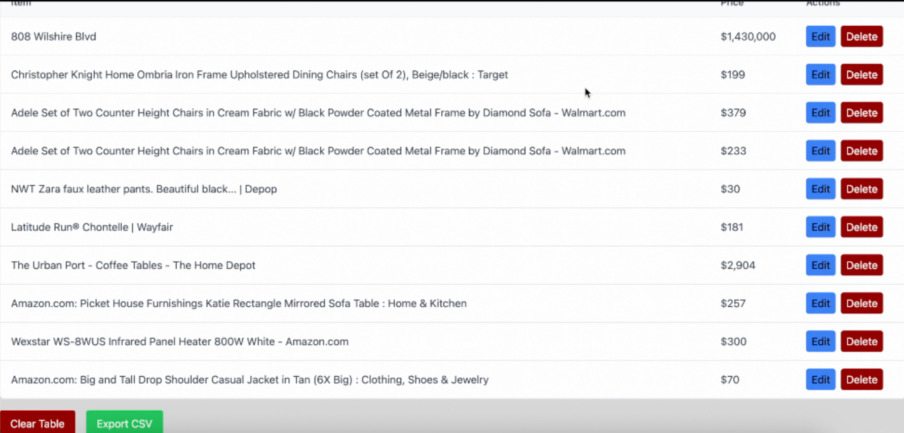

# AutoClaim

This app uses Computer Vision AI to help homeowners scan, value, and protect their belongings from forest fire losses—making the insurance claims process faster and less stressful. 

## Features

- Detects and labels objects in images using YOLOv8.
- Predicts house prices from structured datasets and/or image features.
- RESTful API backend for querying models.
- Multiple frontend interfaces for internal testing and external presentation.

## Demo Screenshots

Sample output from the application:

  
*Dashboard preview*

  
*Result preview*

## Tech Stack

- **Frontend:** React.js
- **Backend:** Flask + Python
- **Computer Vision:** YOLOv8 (Ultralytics)
- **Database:** MySQL
- **DevOps:** Docker, docker-compose

## Getting Started

### Prerequisites

- Docker
- Docker Compose

### Run the Project

To build and start the full stack:

```bash
docker-compose -f docker-compose-build-run.yml up --build